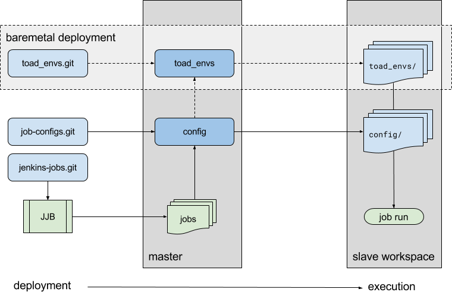

Overrides / Private Info
========================

There may be some variables you don't want to expose into a Git repo. You can
store those in the ``~/.ansible/vars/toad_vars.yml`` file.

.. warning::
   You *must* create a ``~/.ansible/vars/toad_vars.yml`` file, even if
   it is blank. This file is loaded via `var_files` directives in Ansible and
   your deployment will fail if the file doesn't exist.

The following list of options are required when deploying to an OpenStack
cloud:

**Cloud Configuration**

* ``cloud_name_prefix``
* ``cloud_name``
* ``cloud_region_name``
* ``cloud_availability_zone``
* ``cloud_image``
* ``cloud_flavor``
* ``cloud_key_name``

The ``jenkins_scp_sites`` variable is required when you need to copy
configuration files off the slave to the master. Note that the hostname is
relative to the master (in this case, files are copied off the slave **into**
the master node, since that's where the SCP command is run).

**SCP Site Configuration**

::

    jenkins_scp_sites:
      - hostname: 127.0.0.1
        path: "{{ jenkins_master_results_directory }}"

When adding slaves, you would do so by creating a new file in the ``hosts/``
directory. For example you would create a ``hosts/slaves`` file and add your
Jenkins slaves via the ``[jenkins_slave]`` and ``[jenkins_slave:vars]`` headers.

**Jenkins Slave Configuration**

* ``slave_name``
* ``slave_description``
* ``slave_remoteFS``
* ``slave_host``
* ``slave_port``
* ``slave_credentialsId``
* ``slave_label``

Example Override Variable File
------------------------------

Many of the values can be found in your OpenStack RC file, which can typically
be found in the *Access & Security* section of the Horizon dashboard.

::

    cloud_name_prefix: redhat                  # virtual machine name prefix
    cloud_name: mycloud                        # same as specified in clouds.yml
    cloud_region_name: mycloud_region          # OS_REGION_NAME
    cloud_availability_zone: nova              # availability zone
    cloud_image: c0a97bbd-0cdd-4ed1-b6c1-052123456789    # unique image ID
    cloud_flavor: m1.medium
    cloud_key_name: my_pub_key                 # name of your keypair

    jenkins_job_builder_git_jobs_src: https://github.com/redhat-nfvpe/jenkins-jobs.git   # branched from upstream for customization purposes
    jenkins_job_config_git_src: https://github.com/redhat-nfvpe/job-configs.git
    jenkins_job_builder_config_jenkins_user: admin       # default username
    jenkins_job_builder_config_jenkins_password: admin   # default password

    # Can only specify a single site to SCP files to at the end of the run.
    jenkins_scp_sites:
      - hostname: 127.0.0.1
        path: "{{ jenkins_master_results_directory }}"   # defined in vars/main.yml

Custom Job Configuration
========================

With TOAD it is possible to create your own jobs, job configuration files, and
environment files in order to define your cloud networking configuration. These
configurations are defined by default in order to provide you a sample set of
data to get things started quickly.

It's highly likely you'll want to build your own jobs, and therefore fork the
standard set of configuration repositories, and pass that to the job deployment.

Job Repository Workflow
-----------------------

In the following diagram, you can see how three main Git repositories are used
in the deployment of Jenkins jobs, and then the job configuration and
environment files used in the job run.

There are three main repositories in use within TOAD:

==================== ==================================================================
Repository           Description
==================== ==================================================================
``jenkins-jobs.git`` Definition of the Jenkins Jobs, parsed via Jenkins Job Builder
``job-configs.git``  Extra configuration files used during job deployment on the slave
``toad_envs.git``    Environment files for undercloud and overcloud configuration
==================== ==================================================================

**jenkins-jobs.git**

The ``jenkins-jobs.git`` repository contains the macros and job definitions that
are parsed by Jenkins Job Builder (JJB). During deployment of the Jenkins master
the ansible-jenkins-job-builder role executes and takes information in the
``jenkins-jobs.git`` repo and builds the job files and configures the Jenkins
master.

**jobs-configs.git**

During job runs, files in ``jobs-configs.git`` are copied from the master to the
slave, and used during the TripleO Quickstart (oooq) runs. The types of files
copied over would include:

* requirements files for extra python packages or Ansible roles used during the
  run
* yaml files containing variables used during Ansible execution (oooq, roles)
* scripts used during image build runs (jinja2)

**toad_envs.git**

The ``toad_envs`` repository holds various hardware environment configuration
files used for the deployment of the network during a TripleO run. These files
are used by the undercloud during the OpenStack stack deployment in order to
know how to configure the networking. These files are generally only used in
baremetal overcloud deployments.
